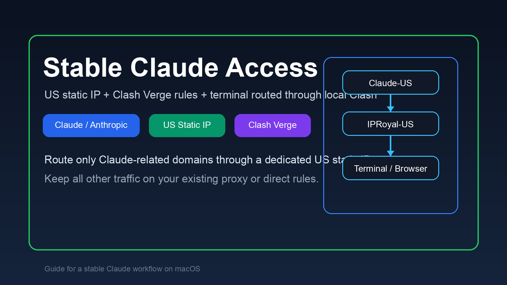
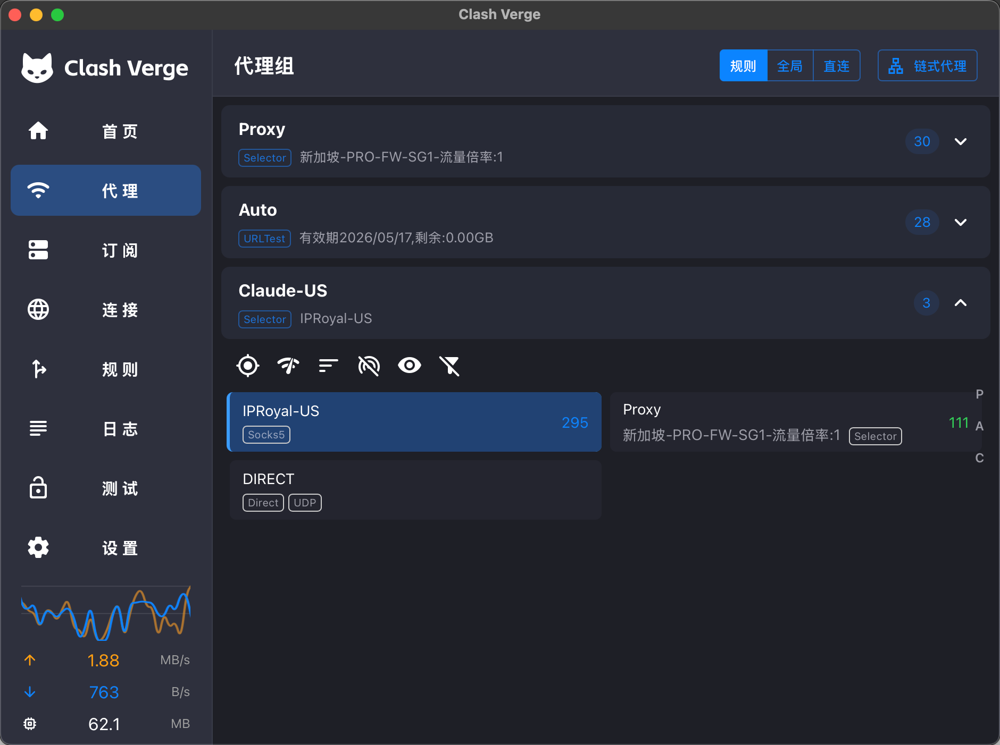
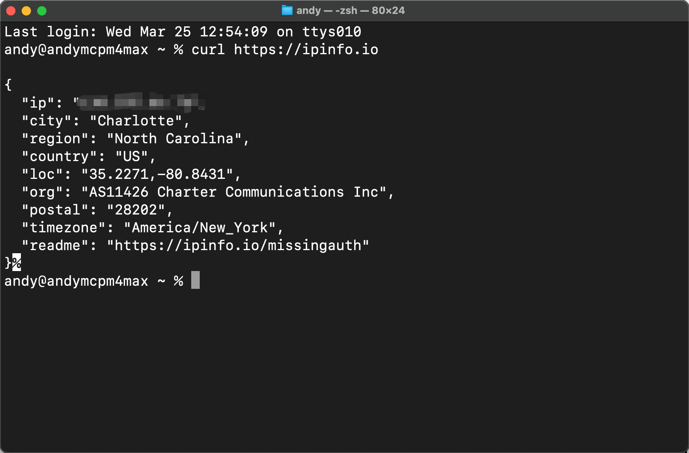
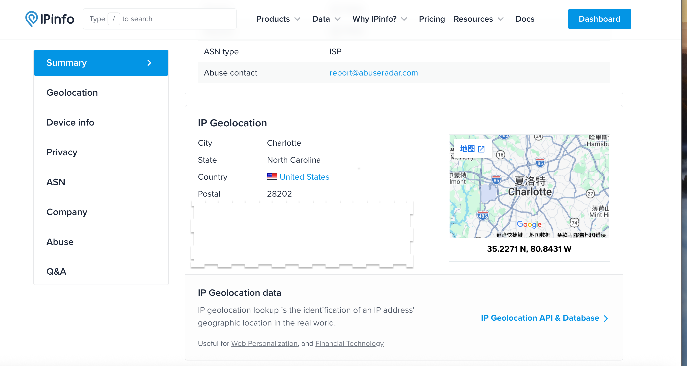

# 如何让 Claude 更稳定、更少受 IP 变化影响



这是一份面向个人用户的实战手册，目标很明确：

- 让 `Claude / Anthropic` 相关流量尽量固定走同一个美国静态 IP
- 让其他流量继续走你已有的通用代理或直连，避免把所有请求都压到一个静态 IP 上
- 让浏览器、Clash Verge、终端尽量遵循同一套规则

这份方案的核心不是“所有流量都强制走美国”，而是：

- `Claude` 相关域名走固定美国静态 IP
- 其他流量继续走更通用、更弹性的代理方案

这样通常比“全局只用一个静态 IP”更稳，也更适合长期使用。

> 说明：本文聚焦稳定访问与一致的网络身份，不承诺绕过平台规则，也不建议把固定 IP 用于违反服务条款的行为。

## 目录

- [为什么 Claude 会忽快忽慢，甚至表现不稳定](#为什么-claude-会忽快忽慢甚至表现不稳定)
- [购买方法](#购买方法)
- [IPRoyal 参数说明](#iproyal-参数说明)
- [给 Codex / Claude 的一键配置提示词](#给-codex--claude-的一键配置提示词)
- [仓库内置 Skill](#仓库内置-skill)
- [Clash Verge 配置方法](#clash-verge-配置方法)
- [只让 Claude / Anthropic 走静态 IP](#只让-claude--anthropic-走静态-ip)
- [终端如何遵循 Clash 规则](#终端如何遵循-clash-规则)
- [配置完成后的测试方法](#配置完成后的测试方法)
- [常见问题与排错](#常见问题与排错)
- [相关资源](#相关资源)

## 为什么 Claude 会忽快忽慢，甚至表现不稳定

很多人以为只要“能翻”就行，但对 `Claude` 这类服务来说，真正影响体验的通常是下面几件事：

- 出口 IP 经常变化
- 网络环境一会儿是香港，一会儿是新加坡，一会儿是美国
- 浏览器访问和终端访问走的是两套路由
- 所有流量都堆到一个不稳定的节点上

如果你的目标是“让 Claude 长期更稳定”，通常更合理的方法不是让所有网站都走固定美国 IP，而是：

1. 给 `Claude / Anthropic` 单独准备一个固定美国静态 IP  
2. 用 `Clash Verge` 做规则分流  
3. 浏览器和终端都先走本机 Clash，再由 Clash 统一决定流量去向

## 购买方法

### 推荐购买类型

如果你的目标是让 `Claude` 更稳定，优先看：

- `ISP / Static Residential / Static ISP`

不优先推荐：

- 自动轮换住宅代理
- 把所有业务都塞进一个共享流量池

原因很简单：你要的是“固定身份感”，不是“疯狂换 IP”。

### 购买时怎么选

建议先这样买：

- 国家：`United States`
- 数量：`1`
- 周期：先 `30` 或 `60` 天
- 协议：后续优先试 `SOCKS5`

如果只是测试，不建议一开始买很多个。

### 我为什么最终选 IPRoyal

这类场景里常见的 3 家选择可以先看：

1. [IPRoyal 静态代理](https://iproyal.com/?r=1275711)  
   适合个人用户先低成本试水，后台简单，接入 Clash 比较直接。

2. [Bright Data](https://brightdata.com/)  
   品牌成熟，产品线完整，企业能力强，但价格和复杂度通常更高。

3. [Oxylabs](https://oxylabs.io/)  
   也是成熟的代理厂商，偏企业级和数据采集场景，整体门槛往往高于个人入门。

如果你的目标是：

- 先把 `Claude` 稳定下来
- 自己能配置
- 成本别太夸张

那 `IPRoyal` 通常更适合作为第一选择。  
如果你已经是团队、公司级用量，或者需要更强的供应商支持，再看 Bright Data / Oxylabs 会更合理。

## IPRoyal 参数说明

买完之后，你通常会拿到这些参数：

- `Host`
- `Port`
- `Username`
- `Password`
- `Protocol`

例如：

```txt
Host: 130.255.66.76
Port: 12324
Protocol: SOCKS5
Username: your_username
Password: your_password
```

### 这些参数分别是什么意思

- `Host`：代理服务器地址
- `Port`：代理端口
- `Username / Password`：鉴权信息
- `Protocol`：告诉客户端按 `HTTP` 还是 `SOCKS5` 接入

### 页面里的 Format 要不要改

通常不用。

`Format` 只影响你点击：

- `Copy list`
- `Download list`

时，文本导出的排列方式，比如：

- `HOST:PORT:USER:PASS`
- `USER:PASS@HOST:PORT`

它**不会影响代理本身工作**。  
如果你只是手动配 Clash，保持默认即可。

## 给 Codex / Claude 的一键配置提示词

如果你在本地有 `Codex`、`Claude Code` 或其他能直接操作文件的 AI 助手，可以把下面这段提示词直接发给它。

### 最短可用提示词

```text
我已经有一个 IPRoyal SOCKS5 静态美国 IP，请帮我把它接入本机 Clash Verge。

要求：
1. 不删除我现有的订阅代理。
2. 先备份 Clash 配置。
3. 新增一个节点名叫 IPRoyal-US。
4. 新增一个代理组名叫 Claude-US。
5. 只让以下域名走 Claude-US：
   - claude.ai
   - anthropic.com
   - claudeusercontent.com
   - ipinfo.io（仅用于测试）
6. 其他流量继续按我原来的 Clash 规则走。
7. 终端不要直接连代理供应商，而是只连接本机 Clash 端口，让终端流量也遵循 Clash 当前规则。
8. 修改完成后，请给我测试命令。

参数如下：
- type: socks5
- host: 你的 host
- port: 你的 port
- username: 你的 username
- password: 你的 password

我的 Clash Verge 配置目录一般在：
~/Library/Application Support/io.github.clash-verge-rev.clash-verge-rev/
```

### 安全版提示词

```text
请帮我在 macOS 上修改 Clash Verge 配置，但必须遵守这些约束：

1. 不要删除我原有的订阅和节点。
2. 所有修改前先做备份。
3. 优先修改 Clash Verge 的增强配置文件，而不是破坏远程订阅主文件。
4. 只给 Claude / Anthropic 相关域名绑定静态美国 IP。
5. 终端流量必须先连本机 Clash，再由 Clash 规则分流。
6. 修改后请验证 YAML 合法性。
7. 不要改动我无关的 shell 配置和业务项目文件。
```

## 仓库内置 Skill

如果你需要反复在别人的电脑上做同样的事情，这个仓库已经附带了一个可复用 skill：

- [skills/claude-us-clash-config/SKILL.md](skills/claude-us-clash-config/SKILL.md)

这个 skill 的定位是：

- 不删除现有订阅
- 给 `Claude / Anthropic` 单独接入固定美国静态 IP
- 终端只连接本机 Clash，再由 Clash 规则分流
- 改完后自动验证

如果你在本地使用支持 skills 的 Codex / Claude 环境，可以直接把这份 skill 放进你的技能目录，或者让 AI 读取仓库中的这份 skill 来执行。

## Clash Verge 配置方法

### 推荐思路

不要把 `IPRoyal` 直接设成全局唯一主线路。  
更合理的是：

- 原订阅继续保留
- 新增一个 `IPRoyal-US`
- 新增一个专门用于 `Claude` 的组，例如 `Claude-US`
- 只有极少数域名走 `Claude-US`

### 推荐配置结果

最终你在 Clash 里至少会有：

- 节点：`IPRoyal-US`
- 代理组：`Claude-US`

而 `Claude-US` 里面建议保留 3 个选项：

- `IPRoyal-US`
- `Proxy`
- `DIRECT`

这样出问题时，切换也很方便。

### 参考效果图

下面这张图表示配置完成后，`Claude-US` 这个组已经存在，并且当前选择的是 `IPRoyal-US`。  
这说明 `Claude / Anthropic` 相关流量会优先走你单独配置的静态美国 IP，而不是直接复用原来的通用订阅节点。



## 只让 Claude / Anthropic 走静态 IP

这是这套方案最关键的部分。

推荐只让下面这些域名走静态美国 IP：

```txt
claude.ai
anthropic.com
claudeusercontent.com
ipinfo.io
intercomcdn.com
intercom.io
intercomassets.com
sentry.io
segment.io
```

如果你在 Clash Verge 的增强规则文件里维护，规则通常类似：

```yaml
prepend:
  - DOMAIN-SUFFIX,ipinfo.io,Claude-US
  - DOMAIN-SUFFIX,claude.ai,Claude-US
  - DOMAIN-SUFFIX,anthropic.com,Claude-US
  - DOMAIN-SUFFIX,claudeusercontent.com,Claude-US
  - DOMAIN-SUFFIX,intercomcdn.com,Claude-US
  - DOMAIN-SUFFIX,intercom.io,Claude-US
  - DOMAIN-SUFFIX,intercomassets.com,Claude-US
  - DOMAIN-SUFFIX,sentry.io,Claude-US
  - DOMAIN-SUFFIX,segment.io,Claude-US
```

重点是用 `prepend`，而不是 `append`。  
否则前面的旧规则可能先命中，导致你以为走了静态 IP，实际却还是跑到了别的节点。

## 终端如何遵循 Clash 规则

终端正确的做法不是“直连 IPRoyal”，而是：

- 终端只连本机 Clash
- 由 Clash 再按规则决定流量到底走：
  - `Claude-US`
  - 原订阅 `Proxy`
  - 或 `DIRECT`

### 推荐终端环境变量

```bash
export http_proxy="http://127.0.0.1:7897"
export https_proxy="http://127.0.0.1:7897"
export all_proxy="socks5h://127.0.0.1:7897"
export HTTP_PROXY="$http_proxy"
export HTTPS_PROXY="$https_proxy"
export ALL_PROXY="$all_proxy"
```

这样做的好处是：

- 浏览器和终端尽量走同一套规则
- 不会因为你手动给终端配置另一套代理，导致两边结果对不上
- 如果以后你调整 Clash 规则，终端会自动跟着变

## 配置完成后的测试方法

### 终端测试

先让当前 shell 读取你的配置：

```bash
source ~/.zshrc
```

确认终端已经接到本机 Clash：

```bash
env | grep -i proxy
```

你应该能看到类似：

```txt
http_proxy=http://127.0.0.1:7897
https_proxy=http://127.0.0.1:7897
all_proxy=socks5h://127.0.0.1:7897
```

然后测试出口 IP：

```bash
curl https://ipinfo.io
```

如果这里返回的是你的美国 IP，说明：

- 终端已经走到了 Clash
- `ipinfo.io` 命中了 `Claude-US`
- 当前静态 IP 规则生效

下面这张图就是一个终端测试通过的例子：  
`curl https://ipinfo.io` 返回了美国位置和对应 IP 信息，说明终端已经通过本机 Clash 命中 `Claude-US` 规则。



再测试 Claude 相关域名连通性：

```bash
curl -I https://claude.ai
curl -I https://www.anthropic.com
```

如果能返回 `200`、`301`、`302` 之类的响应，说明这条链路基本可用。

### IP 网站测试方法

浏览器里直接打开：

- [IPInfo](https://ipinfo.io)

观察是否显示为你买到的美国 IP。

然后再打开：

- `https://claude.ai`
- `https://www.anthropic.com`

如果这两个能正常访问，而其他普通网站仍按原来规则走，就说明你的分流已经合理了。

下面这张图是浏览器侧验证成功的例子：  
`ipinfo.io` 显示的是美国位置，说明浏览器侧也已经命中了你为 `Claude-US` 配置的静态美国出口。



## 常见问题与排错

### 1. Clash 里显示 Timeout，是不是节点坏了

不一定。

很多时候：

- Clash 的测速方法测不通
- 但真实网页访问是正常的

所以不要只盯着 Clash 首页的延迟数字，更重要的是看：

- `claude.ai` 能不能打开
- `anthropic.com` 能不能打开
- `ipinfo.io` 是否显示正确美国 IP

### 2. 为什么不要让所有流量都走静态 IP

因为这样通常更容易遇到：

- 某个 IP 负担过重
- 某些网站偶发超时
- 开发工具、包管理器、普通网页全都绑定在一个固定 IP 上

更稳的方案通常是：

- 只让最关键的网站走静态 IP
- 其他流量继续走更通用的代理或直连

### 3. HTTP 还是 SOCKS5

如果你已经在 `SOCKS5` 下更稳定，就继续用 `SOCKS5`。  
对很多客户端和长连接场景来说，`SOCKS5` 往往更合适。

### 4. 规则写了却没生效

优先检查：

- 规则是不是写在 `prepend`
- Clash Verge 的订阅有没有刷新
- 当前代理组是不是已经选中了 `Claude-US -> IPRoyal-US`

## 相关资源

### 1. Claude 固定身份方案：静态代理

如果你的目标是让 `Claude / Anthropic` 尽量保持稳定、减少因为出口 IP 经常变化带来的不确定性，可以看看：

- [用于 Claude 稳定访问的静态代理方案](https://iproyal.com/?r=1275711)

适合的场景：

- 想给 `Claude` 固定一个相对稳定的美国出口
- 不想让账号环境频繁跳国家
- 想把关键域名单独拎出来走固定 IP

### 2. 通用海外访问方案：更适合做主线路和兜底

如果你的需求是：

- 大多数海外网站都要访问
- 希望日常使用更省心
- 静态 IP 只留给少量关键场景

那更建议保留一个通用代理作为主线路或备用线路：

- [通用代理与日常海外访问方案](https://secure.shadowsocks.au/aff.php?aff=84703)

这类方案更适合：

- 日常浏览
- 工具更新
- 下载依赖
- 作为静态 IP 之外的补充

### 3. AI 工作流提效工具

如果你已经开始同时使用：

- Codex
- Claude
- 本地自动化
- 各种开发和内容工作流

那可以看看：

- [Typeless：适合 AI 工作流的效率工具](https://www.typeless.com/?via=andy-lei)

它更适合的不是“替代代理”，而是：

- 让日常 AI 工作流更顺手
- 减少重复操作
- 提高从想法到执行的效率

---

如果你准备把这套方法交给本地 AI 直接配置，优先从上面的“给 Codex / Claude 的一键配置提示词”开始。
